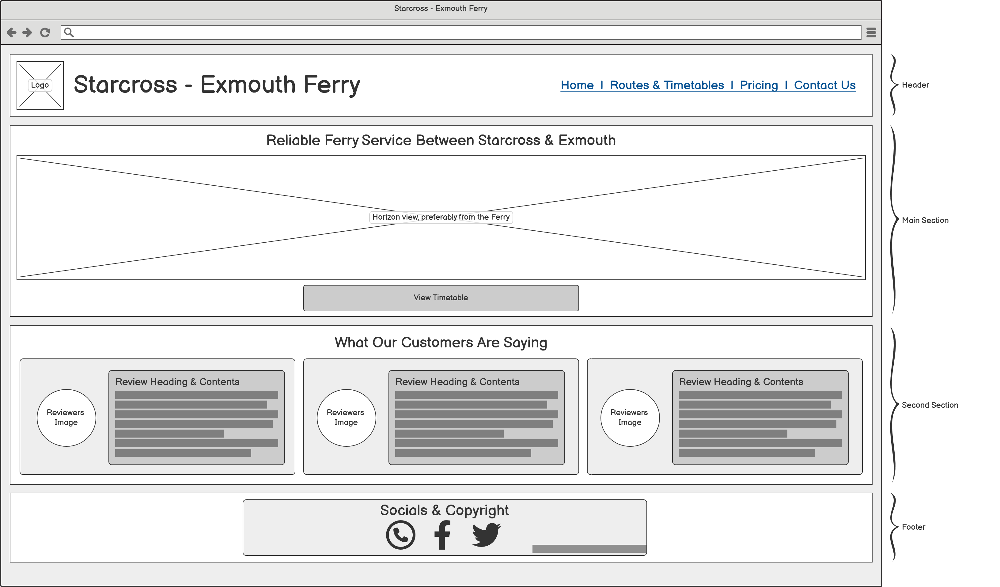
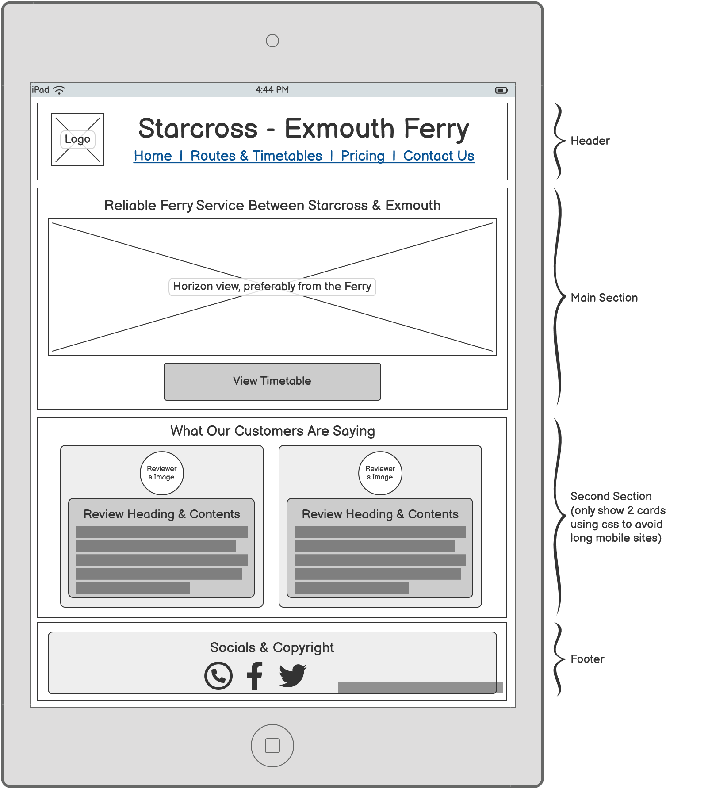
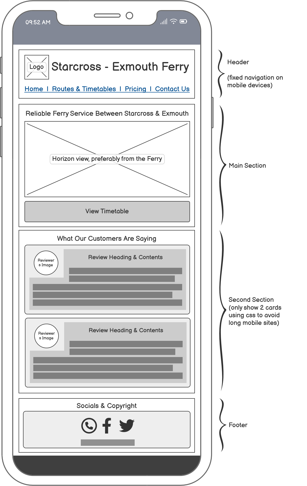

# Starcross Exmouth Ferry

A website providing **route details, ferry schedules, pricing, and contact information** for passengers traveling between Starcross and Exmouth.

## Overview for site requirements

This site is intended to serve the public who would like to travel via the Starcross to Exmouth Ferry, for leisure or commuting. The site aims to provide key information such as:

-   Routes
-   Timetables
-   Pricing
-   Contact details

## Navigation

### 1. Home Page (`index.html`)

-   An overview of the ferry showing brief information about months that the service is operable, information to draw potentials customers to use the service and pictures of the service & scenery.

### 2. Route & Timetable (`route.html`)

-   The first section will show the timetable as this would be the most required information and therefore would be beneficial to make it the first item that a customer is presented with. This will include times showing the departure from both sides of the trip.
-   An image, or a map if achievable, showing the route the ferry will follow to give customers an opportunity to plan their trip and find activities / transport to continue their journey.
-   **Important** information regarding to locating and arriving at the ferry, and accessibility.

### 3. Pricing (`pricing.html`)

-   Breakdown of pricing, acompanied by important details regarding methods of payment and key information to ensure a smooth experience.
-   Dislaimers such as
    -   During peak times the ferry service may be busy.
    -   No possiblility to pre-book spaces.
    -   Cash only due to inconsistent network connectivity.
-   Availability for hire for earlier and later trips, contact required - link to _contact_ page.

### 4. Contact Us (`contact.html`)

-   Key people involved with the ferry
-   Provide contact information
-   Provide contact times, for example, not outside of X:XX to Y:YY hours

## Use Cases

### 1. Tourist

**Who:** A tourist looking for ferry schedules and booking information.

**Why:** They may want to plan their trip and check available routes.

**How:**

-   Visit the homepage and navigate to the "Routes & Timetables" page.
-   View the available route and check the schedule.
-   Click on "Contact Us" to call us in the event of uncertainty.

### 2. Business - Advertisment

**Who:** A business looking to collaborate.

**Why:** They want to arrange a partnership with the ferry to advertise and recommend passengers to visit nearby attractions, shops or services with the prospect to bring in new customers.

**How:**

-   Visit the homepage.
-   Locate the "Contact Us" page.
-   Use the provided form to submit key information for the team to review and contact you back.

### 3. Business - Travel

**Who:** A business looking to use the ferry outside of regular hours.

**Why:** They want to arrange a ferry trip, outside of regular hours, in order to allow staff a convinient and safe route home after an event or gathering.

**How:**

-   Visit the homepage.
-   Locate the "Contact Us" page.
-   Locate and call the available phone numbers, or use the provided form to submit key information for the team to review and contact you back.

### 4. Photographer

**Who:** A photographer or journalist looking to utilise the ferry to capture footage or photographs for various uses.

**Why:** They may want to see the route taken, images of the journey or the images of the surrounding area to determine if they would be able to gather suitable footage.

**How:**

-   Visit the homepage.
-   Scroll down the page to see selected images.
-   Locate the "Routes & Timetables" page.
-   View the available route and additional pictures.

## Technologies Used (Planned)

| Technology       | Purpose                                                |
| ---------------- | ------------------------------------------------------ |
| **HTML**         | Structures content and elements of the site.           |
| **CSS**          | Stylse the site, including layout, colours, and fonts. |
| **Font Awesome** | Provides appealing icons.                              |
| **Git & GitHub** | Version control and repository.                        |
| **GitHub Pages** | Deployment of the site.                                |

## Wireframes

The website layout was planned using wireframes to ensure a user-friendly and responsive design. Below are the wireframes for desktop, tablet, and mobile views of the home page.

### Desktop Wireframe

### Tablet Wireframe

### Mobile Wireframe

These wireframes helped structure the website before development, ensuring a clear navigation layout and proper content positioning.

## Bugs/Issues

-   Responsive page sizes (tablet view)
    Views on different devices do not appear as expected, with the mobile view being below the minimum window width on desktop Google Chrome / Microsoft Edge.

    > -   Cause: Incorrect media sizes were taken from Balsamiq wireframe.
    > -   Fix: Updated media queries to use more acceptable size ranges.
    > -   Check: Tested by resizing the web browser on local environment. Also utilised GitHub pages to view on real mobile devices. Views appear generally correct, but more consideration needs to be made towards responsive design.

-   Navigation incorrect (tablet view)
    The incorrect navigation layout is beign shown on the tablet view, which matches the mobile view rather than being more similar to the desktop view.

    > -   Cause: When creating media queries mobile navigation CSS must have been left into tablet view by accident
    > -   Fix: Removed all navigation related CSS from tablet sizes. New navigation styling to be added to ensure it scales with tablets better rather than using the base, desktop, styles permanently.
    > -   Check: Viewed page in web browser on local environment. Navigation now is closer to expected, I need to review responsive sizes instead of static sizing for fonts, site wide. Navigation is overlapping when compressed and deforming buttons making for a difficult keypress on tablet devices without a pointing device.

-   Navigation button deformations / overlapping
    As mentioned in the previous issues, the change to the navigation is causing overlapping and deformation on mobile views.

    > -   Cause: Responsive sizes are not adequate for the tablet view. Currently static sizing is used for fonts, this needs to be updated to continue building the master page layout.
    > -   Fix: Updated all font sizes to be rem sizing's rather than px, across the entire CSS file. These are not perfect, but can be fine tuned as needed. Px sizing commented out but still present for reference if required later.
    > -   Check: Tested on Google Chrome with multiple browser sizes, as well as mobile devices utilising GitHub pages. Mobile view looks good despite placeholder content, but I'm still not happy with tablet view.

-   The website footer is floating at the end of content
    The footer should be sticky to the bottom of the browser window, not shown at the end of the content. If their is not enough content to fill the viewable area, the footer will be incorrectly positioned.
    > -   Cause: No top-margin defined and <main> tag is missing and therefore causing inconsistent site semantics.
    > -   Fix: top margin added to footer with value auto and <main> tag added. To ensure that the footer is always in the correct place, a flex grid has been added to the body of the page as well as a height of 100% to ensure that content fills the browser sizes. This will caused the footer, along with the margin, to be pushed to the bottom of the page.
    > -   Check: Tested locally using browser windows being resized. I have then commited the updated code and checked on multiple mobile devices to ensure that the changes are showing correctly on real devices as well as the tested virtual devices.

## Credits & Attribution

| Source                                                                              | Content Used                                 |
| ----------------------------------------------------------------------------------- | -------------------------------------------- |
| [Starcross Exmouth Ferry Facebook](https://www.facebook.com/StarcrossFerry)         | Images                                       |
| [Starcross Exmouth Ferry Official Site](https://starcrossexmouthferry.co.uk/)       | Schedules, pricing, and detailed content     |
| [Google Reviews](https://www.google.co.uk/search?q=Starcross+Exmouth+Ferry+reviews) | Customer review descriptions                 |
| [W3Schools](https://www.w3schools.com)                                              | HTML references & responsive design guidance |
| [Colorhunt](https://colorhunt.co)                                                   | Colour palette (c9e4de87cbb9569daa577d86)    |
